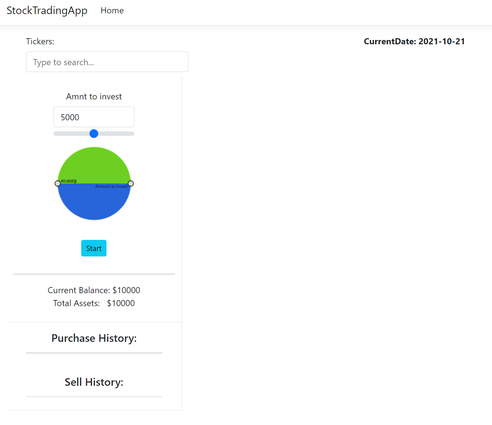
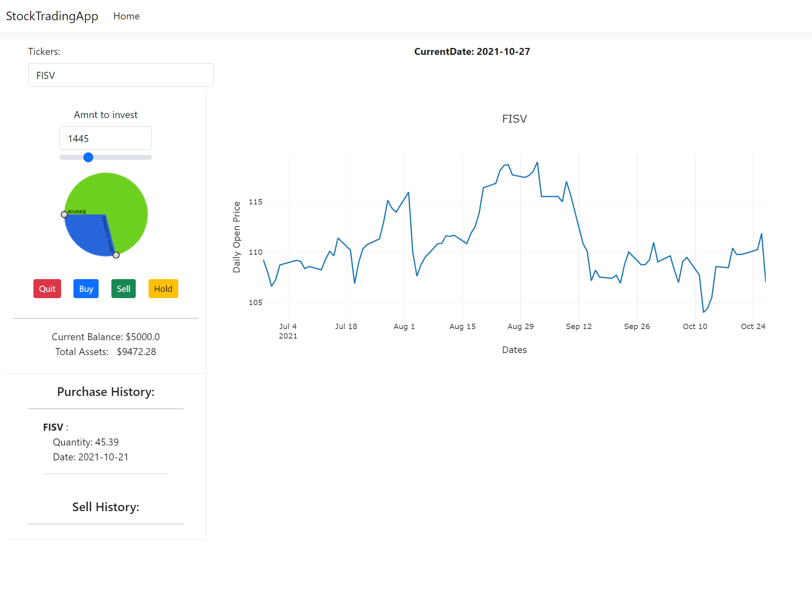
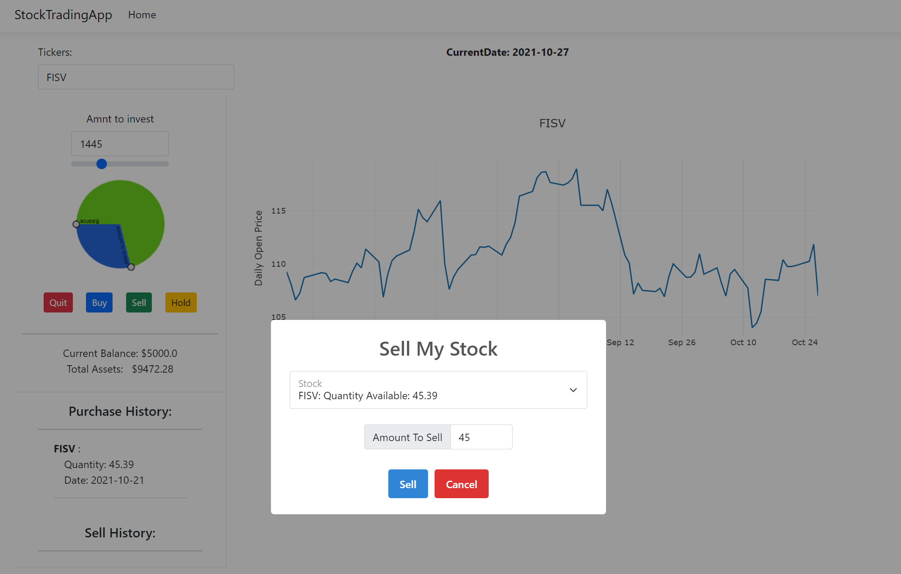
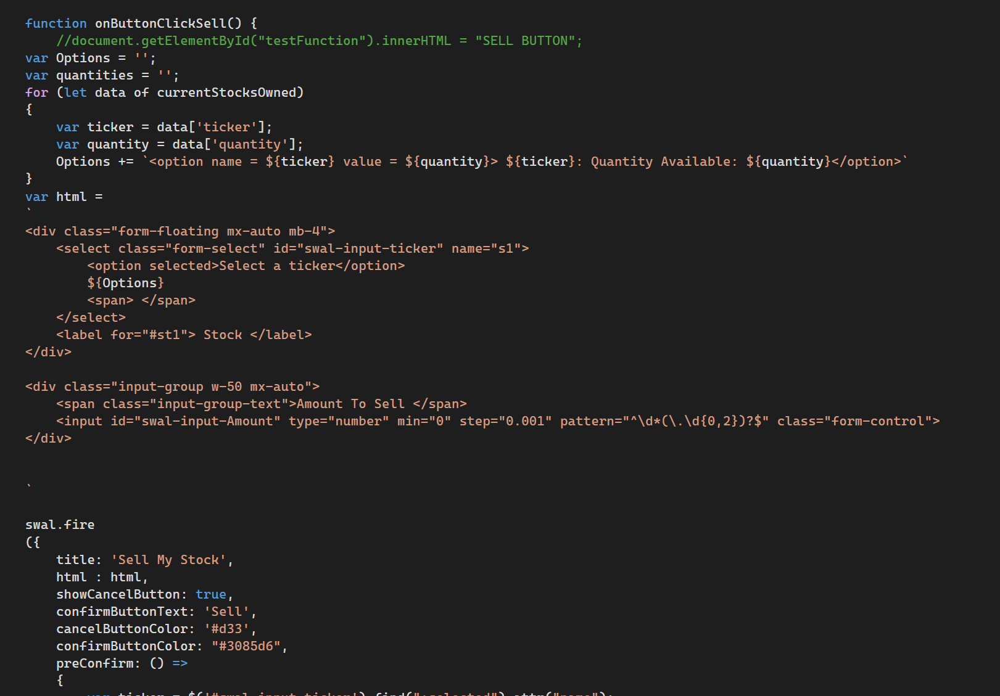

<html>
    <head>
        <link rel="stylesheet" href="https://cdn.jsdelivr.net/npm/bootstrap@4.3.1/dist/css/bootstrap.min.css" integrity="sha384-ggOyR0iXCbMQv3Xipma34MD+dH/1fQ784/j6cY/iJTQUOhcWr7x9JvoRxT2MZw1T" crossorigin="anonymous">
        
<a class="btn btn-secondary" href="https://gkarma5523.github.io/Portfolio/" role="button"><--Back</a>

        <h2>Stock Trading S&P 500</h2>
    </head>
    <body>
        
The stock trading add will be one that you can fully utilize. Not only is the "game" complete but it utilizes real data. With the help of API's we pulled to top 500 stocks within the S&P from the last year. We saved the open, close, average, and date information for everyday over that year. When you start your investing, a random date is selected at what point you can choose a stock to invest in. Once you choose your amount and buy in, the date will jump seven days and display the value of the stock you purchased the week prior. From that information, it will recalculate your overall gain/loss and display that information for you. Like all stocks, you have not made or lost money until you sell which is most the work I did. Once you sell, the amount of stock you sell will recoupe financially into your assets and the remainder will continue to gain or lose money. Enjoy the game and put your knowledge to the test.

        

            

                

                    
                    
The main game page

                

                

                    
                    
The stock and line graph

                

            

        

        
As the images show, you can not only see the amount of money you have from the slider to the pie chart, but you can see the line graph of how the stock has been doing over the time frame listed at the bottom. Your buy and sell is listed on the left pane so that you can track your efforts. When you are done you can close the app or refresh it to start over.

        
        <h4>Struggles:</h4>
        
There were many things that helped with this project. By this time, we have worked the server to client connection a few times. Once up and running, that portion is not to bad though with this project one of the big struggles was determining how we wanted to store session data. The lack of a login created an obsticle where when you accessed the application, we had to determine how we retained data upon button clicks or reloads of the application. That along with the pie chart that my teammate spent hours on to update with the spending and occruing of money and the selling of the stocks that I worked on gave us a run for our money. I had to look at the sell button from a stock perspective where the buy was from a money perspective. You can't sell what you don't have and being able to access that data and reference it to the exact amount took me some time.

        

            

                

                    
                    
Selling the stock you own

                

                

                    
                    
The HTML code designing the page

                

            

        

    </body>
</html>
